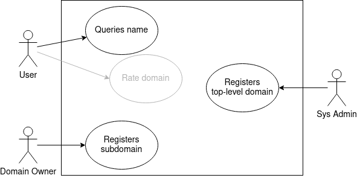
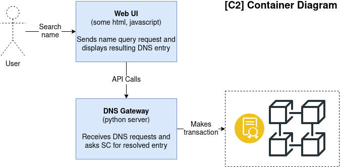

#  Distributionly a Blockchain-based DNS

`This project is an assignment for the BCOLN lecture at the University of Zurich.`
## Installation and Deployment
- Set up local blockchain on port 7545
- Download the metamask extension for your browser
- Sync local blockchain to your metamask account through the seed phrases
- Make sure node.js and truffle are downloaded
- After navigating to the client subfolder in console: 
    - npm install
    - npm start
    - cd ..
    - truffle migrate --reset --network develop
- Navigate to localhost:3000 in your browser
- Enjoy!

## Contract API

- bid(string memory _domain) public payable  
    - start auction if not existing
    - bid on existing auction
- withdraw(string memory _domain) public 
    - get money back if auction not won
- claim (string memory _domain) public payable
    - winner can register domain name in registry.
    - This function only can be call from the owner of the domain. 
    - It will check if the one who is calling this function is the one register in the action as the highestBidder.
- configureDomain(string memory _domain, string memory ipv4, string memory ipv6) public payable
    - set dns zone file configuration
    - currently ipv4 and ipv6 addresses
    - only callable by the domain owner
- getDomainInfo(string memory _domain) public view returns(string memory state, string memory ipv4, string memory ipv6, address owner)
    - returns the information of the domain *state, ips, owner of the domain* , being "state" between these possible values {*registered, inauction, toberegistered, free*}
- getAuctionState(string memory _domain) public view returns (string memory domain, address higestBidder, uint256 highestBid, uint256 auctionEndTime, bool claimed, bool exists, bool accountHasReturns)
    - returns the current state of an auction

## Brief Description & Ideation

The goal of this project is to rebuild the basic functionality of a Domain Name System (DNS) based on a blockchain and smart contracts.

The system must be able to resolve human-readable names to technical addresses. A domain owner can register his subdomain to a known top level domain. A subdomain can have other subdomains. Optionally the system could allow a domain abuse rating system or a domain certification service (note that X.509 PKI functionality is out of scope). 

- A simple domain abuse reporting system could be that everyone except the domain owner report incorrect behavior. The domain owner can flush all reported missusages and reset his domain `TODO: refine reporting concept`.
- The focus lies on IPv4 and IPv6 addresses. Other address schemes are out of scope for this project. Technical top-level domains are managed by the system administrator.
- The name resolver functionality can be implemented in an external python script or a smart contract. 
- The registration and the certification of a subdomain costs ether. Can we buy or bid on a domain name? `TODO: refine economic concept`.
- Bootstraping and registration of top level domains is out of scope. 

## Addressing BCOLN Requirements

1. The core functionality must be implemented and executed entirely within Smart Contracts (SC).

    - Manage and resolve domain names 

1. The SC must implement an economic aspect, e.g., a payment system, incentives, gambling, or any economy-related functionality.

    - Auction system to aquire a domain

1. The user must interact with the DApp via a Graphical User Interface (GUI), for example, a Web-based one.

    - Web interface to query names, display and register DNS entries

1. The group must deliver a self-contained report documenting the SC, its operation, and the source code.

    - OK

